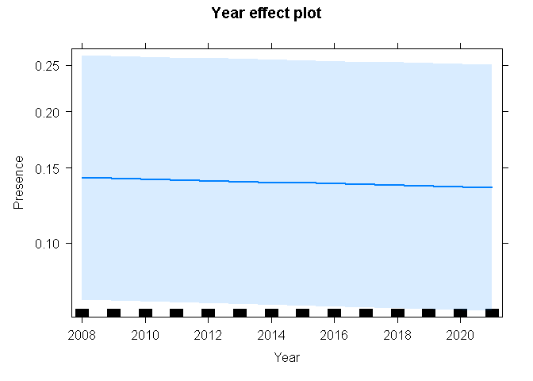

fyn_noscale
================
Christopher Shortland
2022-06-20

# Libraries

``` r
library(tidyverse)
```

    ## -- Attaching packages --------------------------------------- tidyverse 1.3.1 --

    ## v ggplot2 3.3.5     v purrr   0.3.4
    ## v tibble  3.1.6     v dplyr   1.0.8
    ## v tidyr   1.2.0     v stringr 1.4.0
    ## v readr   2.1.2     v forcats 0.5.1

    ## -- Conflicts ------------------------------------------ tidyverse_conflicts() --
    ## x dplyr::filter() masks stats::filter()
    ## x dplyr::lag()    masks stats::lag()

``` r
library(lme4)
```

    ## Loading required package: Matrix

    ## 
    ## Attaching package: 'Matrix'

    ## The following objects are masked from 'package:tidyr':
    ## 
    ##     expand, pack, unpack

``` r
library(car)
```

    ## Loading required package: carData

    ## 
    ## Attaching package: 'car'

    ## The following object is masked from 'package:dplyr':
    ## 
    ##     recode

    ## The following object is masked from 'package:purrr':
    ## 
    ##     some

``` r
library(effects)
```

    ## lattice theme set by effectsTheme()
    ## See ?effectsTheme for details.

``` r
library(ggplot2)
library(beepr)
library(sjPlot)
```

    ## Registered S3 method overwritten by 'parameters':
    ##   method                         from      
    ##   format.parameters_distribution datawizard

``` r
library(glmmTMB)
```

    ## Warning in checkMatrixPackageVersion(): Package version inconsistency detected.
    ## TMB was built with Matrix version 1.4.1
    ## Current Matrix version is 1.4.0
    ## Please re-install 'TMB' from source using install.packages('TMB', type = 'source') or ask CRAN for a binary version of 'TMB' matching CRAN's 'Matrix' package

``` r
library(dplyr)
```

\#importing final dataset

``` r
final <- read_csv('output/final_df/final_df.csv')
```

    ## Rows: 17481700 Columns: 11
    ## -- Column specification --------------------------------------------------------
    ## Delimiter: ","
    ## chr  (7): CardNo, Pentad, Spp, Sequence, Common_name, Taxonomic_name, indicator
    ## dbl  (3): Species_Code, Presence, no_pres
    ## date (1): StartDate
    ## 
    ## i Use `spec()` to retrieve the full column specification for this data.
    ## i Specify the column types or set `show_col_types = FALSE` to quiet this message.

# Load fynbos stacked df

``` r
fyn_df <- filter(final, indicator=='fynbos')
```

\#number of indicator species

``` r
fyn_df %>% filter(!Species_Code %in% c('285',"901", "870", "985", "567", "980", "289", "51")) -> fyn_df

length(unique(fyn_df$Common_name))
```

    ## [1] 8

``` r
unique(fyn_df$Common_name)
```

    ## [1] "Spurfowl, Cape"           "-"                       
    ## [3] "Rockjumper, Cape"         "Warbler, Victorin's"     
    ## [5] "Sugarbird, Cape"          "Sunbird, Orange-breasted"
    ## [7] "Siskin, Cape"             "Canary, Protea"

# add in year variable

``` r
fyn_df$Year <- lubridate::year(fyn_df$StartDate)
str(fyn_df)
```

    ## spec_tbl_df [131,426 x 12] (S3: spec_tbl_df/tbl_df/tbl/data.frame)
    ##  $ Species_Code  : num [1:131426] 181 181 181 181 181 181 181 181 181 181 ...
    ##  $ CardNo        : chr [1:131426] "1800-3300_001449_20150411" "1820_3325_001393_20081019" "1820_3325_002076_20090421" "1845_3415_011138_20090904" ...
    ##  $ StartDate     : Date[1:131426], format: "2015-04-11" "2008-10-19" ...
    ##  $ Pentad        : chr [1:131426] "3300_1800" "3325_1820" "3325_1820" "3415_1845" ...
    ##  $ Spp           : chr [1:131426] "181" "181" "181" "181" ...
    ##  $ Sequence      : chr [1:131426] "5" "12" "42" "10" ...
    ##  $ Common_name   : chr [1:131426] "Spurfowl, Cape" "Spurfowl, Cape" "Spurfowl, Cape" "Spurfowl, Cape" ...
    ##  $ Taxonomic_name: chr [1:131426] "Pternistis capensis" "Pternistis capensis" "Pternistis capensis" "Pternistis capensis" ...
    ##  $ Presence      : num [1:131426] 1 1 1 1 1 0 1 1 1 0 ...
    ##  $ no_pres       : num [1:131426] 116 82 82 137 137 29 282 282 282 14 ...
    ##  $ indicator     : chr [1:131426] "fynbos" "fynbos" "fynbos" "fynbos" ...
    ##  $ Year          : num [1:131426] 2015 2008 2009 2009 2009 ...
    ##  - attr(*, "spec")=
    ##   .. cols(
    ##   ..   Species_Code = col_double(),
    ##   ..   CardNo = col_character(),
    ##   ..   StartDate = col_date(format = ""),
    ##   ..   Pentad = col_character(),
    ##   ..   Spp = col_character(),
    ##   ..   Sequence = col_character(),
    ##   ..   Common_name = col_character(),
    ##   ..   Taxonomic_name = col_character(),
    ##   ..   Presence = col_double(),
    ##   ..   no_pres = col_double(),
    ##   ..   indicator = col_character()
    ##   .. )
    ##  - attr(*, "problems")=<externalptr>

# Option to run with Indicator Type as a fixed effect

# glmer1 \<- glmer(Presence \~ Year\*Indicator_Type + (1 + Year\|Species_Code), family = ‘binomial’, data = fyn_df)

# measure time taken…

``` r
start_time <- Sys.time()
```

# run a mixed effects model; year = fixed; species = random

``` r
glmer_fyn <- glmer(Presence ~ Year + (Year|Species_Code) + (1|Pentad), family = 'binomial', data = fyn_df)
```

    ## Warning in checkConv(attr(opt, "derivs"), opt$par, ctrl = control$checkConv, :
    ## Model failed to converge with max|grad| = 0.177373 (tol = 0.002, component 1)

    ## Warning in checkConv(attr(opt, "derivs"), opt$par, ctrl = control$checkConv, : Model is nearly unidentifiable: very large eigenvalue
    ##  - Rescale variables?;Model is nearly unidentifiable: large eigenvalue ratio
    ##  - Rescale variables?

``` r
beepr::beep()
end_time <- Sys.time()
```

# How long did this take to run?

``` r
end_time - start_time
```

    ## Time difference of 14.89709 mins

# Summary of model

``` r
summary(glmer_fyn)
```

    ## Generalized linear mixed model fit by maximum likelihood (Laplace
    ##   Approximation) [glmerMod]
    ##  Family: binomial  ( logit )
    ## Formula: Presence ~ Year + (Year | Species_Code) + (1 | Pentad)
    ##    Data: fyn_df
    ## 
    ##      AIC      BIC   logLik deviance df.resid 
    ## 122752.4 122811.1 -61370.2 122740.4   131420 
    ## 
    ## Scaled residuals: 
    ##     Min      1Q  Median      3Q     Max 
    ## -5.1649 -0.5310 -0.2776  0.5836 14.8755 
    ## 
    ## Random effects:
    ##  Groups       Name        Variance  Std.Dev. Corr 
    ##  Pentad       (Intercept) 1.321e+00  1.14949      
    ##  Species_Code (Intercept) 4.492e+03 67.01947      
    ##               Year        1.093e-03  0.03306 -1.00
    ## Number of obs: 131426, groups:  Pentad, 470; Species_Code, 7
    ## 
    ## Fixed effects:
    ##               Estimate Std. Error z value Pr(>|z|)    
    ## (Intercept)  7.8391325  1.0614538   7.385 1.52e-13 ***
    ## Year        -0.0047965  0.0005579  -8.597  < 2e-16 ***
    ## ---
    ## Signif. codes:  0 '***' 0.001 '**' 0.01 '*' 0.05 '.' 0.1 ' ' 1
    ## 
    ## Correlation of Fixed Effects:
    ##      (Intr)
    ## Year -0.939
    ## optimizer (Nelder_Mead) convergence code: 0 (OK)
    ## Model failed to converge with max|grad| = 0.177373 (tol = 0.002, component 1)
    ## Model is nearly unidentifiable: very large eigenvalue
    ##  - Rescale variables?
    ## Model is nearly unidentifiable: large eigenvalue ratio
    ##  - Rescale variables?

# Anova

``` r
Anova(glmer_fyn)
```

    ## Analysis of Deviance Table (Type II Wald chisquare tests)
    ## 
    ## Response: Presence
    ##       Chisq Df Pr(>Chisq)    
    ## Year 73.907  1  < 2.2e-16 ***
    ## ---
    ## Signif. codes:  0 '***' 0.001 '**' 0.01 '*' 0.05 '.' 0.1 ' ' 1

# Plot effects

``` r
plot(allEffects(glmer_fyn))
```

<!-- -->
\#predict

``` r
fyn_df$predict <- predict(glmer_fyn, fyn_df)

fyn_clean <- fyn_df %>% group_by(Species_Code, Year) %>% summarise(predict = mean(predict))
```

    ## `summarise()` has grouped output by 'Species_Code'. You can override using the
    ## `.groups` argument.

\#original \#ggplot(data=fyn_df, aes(Year, predict)) +
geom_line(aes(color = as.factor(Species_Code)))

``` r
ggplot(data=fyn_clean, aes(Year, predict)) + geom_line(aes(color = as.factor(Species_Code)))
```

<!-- -->

``` r
plot_model(glmer_fyn, type = "re")
```

    ## [[1]]

<!-- -->

    ## 
    ## [[2]]

<!-- -->
\#number of pentads

``` r
length(unique(fyn_df$Pentad))
```

    ## [1] 470

\#total no. cards

``` r
nrow(fyn_df)
```

    ## [1] 131426

\#presences and absences

``` r
fyn_df %>% group_by(Common_name) %>% count(Presence)
```

    ## # A tibble: 8 x 3
    ## # Groups:   Common_name [8]
    ##   Common_name              Presence     n
    ##   <chr>                       <dbl> <int>
    ## 1 -                               0 91049
    ## 2 Canary, Protea                  1   370
    ## 3 Rockjumper, Cape                1   435
    ## 4 Siskin, Cape                    1  2537
    ## 5 Spurfowl, Cape                  1 20988
    ## 6 Sugarbird, Cape                 1  8915
    ## 7 Sunbird, Orange-breasted        1  5397
    ## 8 Warbler, Victorin's             1  1735
