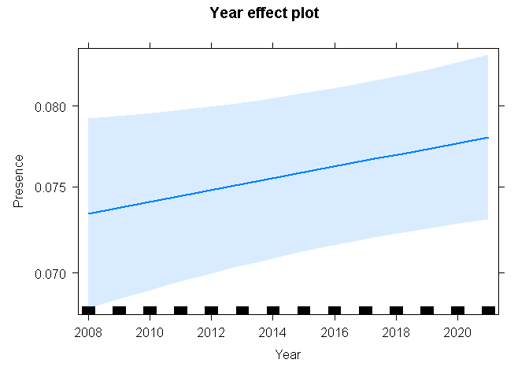
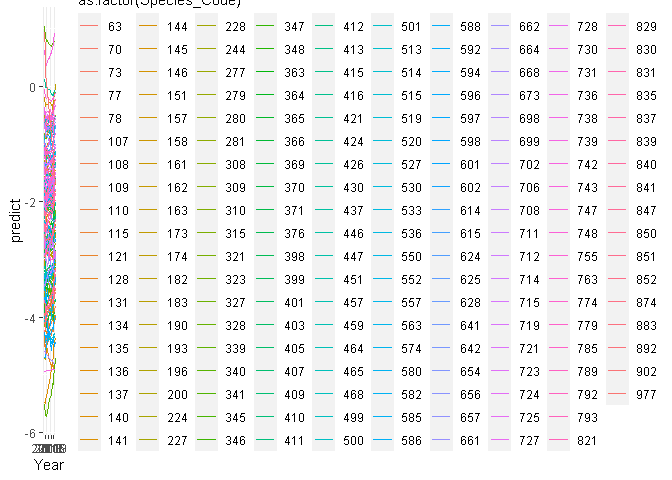
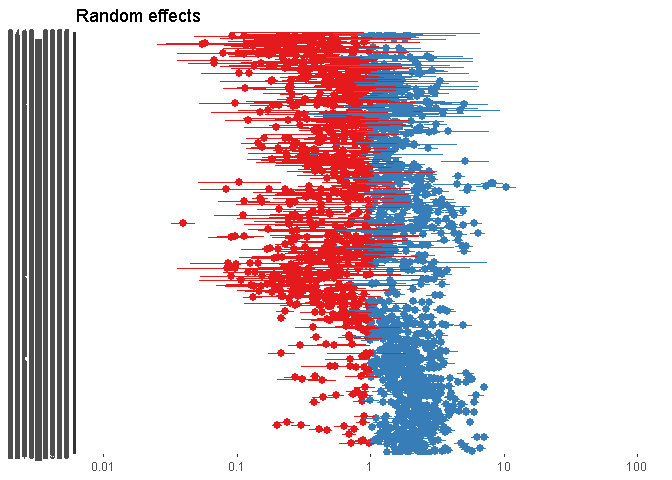
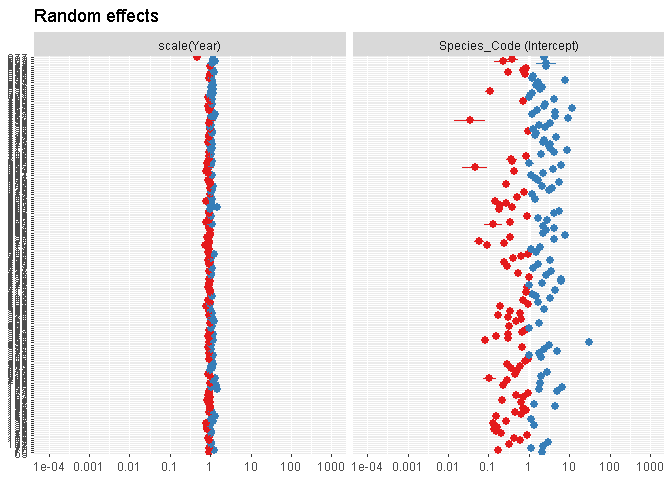

savanna_glmer
================
Christopher Shortland
2022-06-20

# Libraries

``` r
library(tidyverse)
```

    ## -- Attaching packages --------------------------------------- tidyverse 1.3.1 --

    ## v ggplot2 3.3.5     v purrr   0.3.4
    ## v tibble  3.1.6     v dplyr   1.0.8
    ## v tidyr   1.2.0     v stringr 1.4.0
    ## v readr   2.1.2     v forcats 0.5.1

    ## -- Conflicts ------------------------------------------ tidyverse_conflicts() --
    ## x dplyr::filter() masks stats::filter()
    ## x dplyr::lag()    masks stats::lag()

``` r
library(lme4)
```

    ## Loading required package: Matrix

    ## 
    ## Attaching package: 'Matrix'

    ## The following objects are masked from 'package:tidyr':
    ## 
    ##     expand, pack, unpack

``` r
library(car)
```

    ## Loading required package: carData

    ## 
    ## Attaching package: 'car'

    ## The following object is masked from 'package:dplyr':
    ## 
    ##     recode

    ## The following object is masked from 'package:purrr':
    ## 
    ##     some

``` r
library(effects)
```

    ## lattice theme set by effectsTheme()
    ## See ?effectsTheme for details.

``` r
library(ggplot2)
library(beepr)
library(sjPlot)
```

    ## Registered S3 method overwritten by 'parameters':
    ##   method                         from      
    ##   format.parameters_distribution datawizard

    ## Learn more about sjPlot with 'browseVignettes("sjPlot")'.

``` r
library(glmmTMB)
```

    ## Warning in checkMatrixPackageVersion(): Package version inconsistency detected.
    ## TMB was built with Matrix version 1.4.1
    ## Current Matrix version is 1.4.0
    ## Please re-install 'TMB' from source using install.packages('TMB', type = 'source') or ask CRAN for a binary version of 'TMB' matching CRAN's 'Matrix' package

``` r
library(dplyr)
```

\#importing final dataset

``` r
final <- read_csv('output/final_df/final_df.csv')
```

    ## Rows: 17481700 Columns: 11
    ## -- Column specification --------------------------------------------------------
    ## Delimiter: ","
    ## chr  (7): CardNo, Pentad, Spp, Sequence, Common_name, Taxonomic_name, indicator
    ## dbl  (3): Species_Code, Presence, no_pres
    ## date (1): StartDate
    ## 
    ## i Use `spec()` to retrieve the full column specification for this data.
    ## i Specify the column types or set `show_col_types = FALSE` to quiet this message.

# Load fynbos stacked df

``` r
sav_df <- filter(final, indicator=='savanna')
```

\#number of indicator species

``` r
sav_df %>% filter(!Common_name %in% c('200',"668","702","739","883","14193","902")) -> sav_df

length(unique(sav_df$Common_name))
```

    ## [1] 186

``` r
unique(sav_df$Common_name)
```

    ##   [1] "-"                                "Heron, Striated"                 
    ##   [3] "Heron, White-backed Night"        "Stork, Marabou"                  
    ##   [5] "Stork, Woolly-necked"             "Stork, Abdim's"                  
    ##   [7] "Vulture, White-backed"            "Vulture, Lappet-faced"           
    ##   [9] "Vulture, White-headed"            "Vulture, Hooded"                 
    ##  [11] "Hobby, Eurasian"                  "Kestrel, Dickinson's"            
    ##  [13] "Kite, Black"                      "Hawk, Bat"                       
    ##  [15] "Eagle, Tawny"                     "Eagle, Steppe"                   
    ##  [17] "Eagle, Lesser Spotted"            "Eagle, Wahlberg's"               
    ##  [19] "Hawk-Eagle, Ayre's"               "Hawk-eagle, African"             
    ##  [21] "Buzzard, Lizard"                  "Eagle, Brown Snake"              
    ##  [23] "Eagle, Black-chested Snake"       "Sparrowhawk, Ovambo"             
    ##  [25] "Sparrowhawk, Little"              "Goshawk, Gabar"                  
    ##  [27] "Goshawk, Dark Chanting"           "Francolin, Coqui"                
    ##  [29] "Francolin, Crested"               "Spurfowl, Red-billed"            
    ##  [31] "Spurfowl, Natal"                  "Quail, Harlequin"                
    ##  [33] "Guineafowl, Crested"              "Buttonquail, Common"             
    ##  [35] "Crake, Striped"                   "Korhaan, Red-crested"            
    ##  [37] "Bustard, Black-bellied"           "Jacana, African"                 
    ##  [39] "Lapwing, Senegal"                 "Courser, Temminck's"             
    ##  [41] "Courser, Three-banded"            "Courser, Bronze-winged"          
    ##  [43] "Pratincole, Collared"             "Sandgrouse, Burchell's"          
    ##  [45] "Sandgrouse, Yellow-throated"      "Sandgrouse, Double-banded"       
    ##  [47] "Dove, Mourning Collared"          "Dove, Emerald-spotted Wood"      
    ##  [49] "Pigeon, African Green"            "Parrot, Meyer's"                 
    ##  [51] "Parrot, Brown-headed"             "Go-away-bird, Grey"              
    ##  [53] "Cuckoo, Common"                   "Cuckoo, African"                 
    ##  [55] "Cuckoo, Thick-billed"             "Cuckoo, Great Spotted"           
    ##  [57] "Cuckoo, Levaillant's"             "Cuckoo, Jacobin"                 
    ##  [59] "Owl, African Scops"               "Owl, Southern White-faced Scops" 
    ##  [61] "Owlet, Pearl-spotted"             "Owlet, African Barred"           
    ##  [63] "Eagle-Owl, Verreaux's"            "Owl, Pel's Fishing"              
    ##  [65] "Nightjar, European"               "Nightjar, Square-tailed"         
    ##  [67] "Kingfisher, African Pygmy"        "Kingfisher, Woodland"            
    ##  [69] "Kingfisher, Grey-headed"          "Kingfisher, Striped"             
    ##  [71] "Bee-eater, Blue-cheeked"          "Bee-eater, Southern Carmine"     
    ##  [73] "Bee-eater, White-fronted"         "Bee-eater, Little"               
    ##  [75] "Bee-eater, Swallow-tailed"        "Roller, European"                
    ##  [77] "Roller, Lilac-breasted"           "Roller, Purple"                  
    ##  [79] "Roller, Broad-billed"             "Scimitarbill, Common"            
    ##  [81] "Hornbill, African Grey"           "Hornbill, Southern Yellow-billed"
    ##  [83] "Hornbill, Southern Ground"        "Tinkerbird, Yellow-fronted"      
    ##  [85] "Woodpecker, Bennett's"            "Woodpecker, Golden-tailed"       
    ##  [87] "Woodpecker, Bearded"              "Lark, Monotonous"                
    ##  [89] "Lark, Fawn-colored"               "Lark, Dusky"                     
    ##  [91] "Lark, Short-clawed"               "Lark, Flappet"                   
    ##  [93] "Swallow, Grey-rumped"             "Swallow, Mosque"                 
    ##  [95] "Swallow, Red-breasted"            "Cuckooshrike, Black"             
    ##  [97] "Tit, Ashy"                        "Cuckooshrike, White-breasted"    
    ##  [99] "Oriole, Eurasian Golden"          "Oriole, African Golden"          
    ## [101] "Tit, Southern Black"              "Tit, Grey Penduline"             
    ## [103] "Babbler, Arrow-marked"            "Babbler, Southern Pied"          
    ## [105] "Greenbul, Yellow-bellied"         "Thrush, Kurrichane"              
    ## [107] "Thrush, Groundscraper"            "Wheatear, Northern"              
    ## [109] "Chat, Arnot's"                    "Robin-Chat, White-browed"        
    ## [111] "Robin-Chat, White-throated"       "Scrub Robin, Bearded"            
    ## [113] "Scrub Robin, Kalahari"            "Scrub Robin, White-browed"       
    ## [115] "Nightingale, Thrush"              "Whitethroat, Common"             
    ## [117] "Warbler, Icterine"                "Warbler, Olive-tree"             
    ## [119] "Warbler, River"                   "Eremomela, Burnt-necked"         
    ## [121] "Eremomela, Green-capped"          "Wren-Warbler, Barred"            
    ## [123] "Wren-Warbler, Stierling's"        "Apalis, Rudd's"                  
    ## [125] "Apalis, Yellow-breasted"          "Camaroptera, Grey-backed"        
    ## [127] "Cisticola, Tinkling"              "Cisticola, Rattling"             
    ## [129] "Flycatcher, Spotted"              "Flycatcher, Ashy"                
    ## [131] "Tit-Flycatcher, Grey"             "Flycatcher, Marico"              
    ## [133] "Flycatcher, Pale"                 "Flycatcher, Southern Black"      
    ## [135] "Hyliota, Southern"                "Batis, Chinspot"                 
    ## [137] "Pipit, Tree"                      "Pipit, Bushveld"                 
    ## [139] "Pipit, Golden"                    "Shrike, Lesser Grey"             
    ## [141] "Shrike, Red-backed"               "Shrike, Crimson-breasted"        
    ## [143] "Puffback, Black-backed"           "Tchagra, Brown-crowned"          
    ## [145] "Tchagra, Black-crowned"           "Bushshrike, Orange-breasted"     
    ## [147] "Bushshrike, Gorgeous"             "Bushshrike, Grey-headed"         
    ## [149] "Shrike, Magpie"                   "Nicator, Eastern"                
    ## [151] "Helmetshrike, White-crested"      "Helmetshrike, Retz's"            
    ## [153] "Shrike, Southern White-crowned"   "Starling, Violet-backed"         
    ## [155] "Starling, Greater Blue-eared"     "Starling, Miombo Blue-eared"     
    ## [157] "Starling, Meves's"                "Starling, Burchell's"            
    ## [159] "Oxpecker, Yellow-billed"          "Oxpecker, Red-billed"            
    ## [161] "Sunbird, Marico"                  "Sunbird, White-bellied"          
    ## [163] "Sunbird, Scarlet-chested"         "Weaver, Red-billed Buffalo"      
    ## [165] "Sparrow, Great"                   "Weaver, Scaly-feathered"         
    ## [167] "Masked-weaver, Lesser"            "Weaver, Red-headed"              
    ## [169] "Finch, Cut-throat"                "Pytilia, Orange-winged"          
    ## [171] "Pytilia, Green-winged"            "Twinspot, Pink-throated"         
    ## [173] "Firefinch, Jameson's"             "Firefinch, Red-billed"           
    ## [175] "Waxbill, Blue"                    "Waxbill, Violet-eared"           
    ## [177] "Waxbill, Black-faced"             "Whydah, Shaft-tailed"            
    ## [179] "Indigobird, Purple"               "Indigobird, Village"             
    ## [181] "Whydah, Long-tailed Paradise"     "Bunting, Golden-breasted"        
    ## [183] "Heron, Malagasy Pond"             "Flufftail, Streaky-breasted"     
    ## [185] "Tern, Gull-billed"                "Boubou, Ethiopian"

# add in year variable

``` r
sav_df$Year <- lubridate::year(sav_df$StartDate)
str(sav_df)
```

    ## spec_tbl_df [9,206,175 x 12] (S3: spec_tbl_df/tbl_df/tbl/data.frame)
    ##  $ Species_Code  : num [1:9206175] 63 63 63 63 63 63 63 63 63 63 ...
    ##  $ CardNo        : chr [1:9206175] "2025_2850_001868_20101204" "2025_3110_011088_20160827" "2105_3150_010470_20111105" "2120_3110_010330_20130419" ...
    ##  $ StartDate     : Date[1:9206175], format: "2010-12-04" "2016-08-27" ...
    ##  $ Pentad        : chr [1:9206175] "2505_2850" "2925_3110" "2505_3150" "2220_3110" ...
    ##  $ Spp           : chr [1:9206175] "-" "-" "-" "63" ...
    ##  $ Sequence      : chr [1:9206175] "-" "-" "-" "65" ...
    ##  $ Common_name   : chr [1:9206175] "-" "-" "-" "Heron, Striated" ...
    ##  $ Taxonomic_name: chr [1:9206175] "-" "-" "-" "Butorides striata" ...
    ##  $ Presence      : num [1:9206175] 0 0 0 1 0 1 0 0 0 0 ...
    ##  $ no_pres       : num [1:9206175] 9 4 125 79 97 25 57 4 4 4 ...
    ##  $ indicator     : chr [1:9206175] "savanna" "savanna" "savanna" "savanna" ...
    ##  $ Year          : num [1:9206175] 2010 2016 2011 2013 2013 ...
    ##  - attr(*, "spec")=
    ##   .. cols(
    ##   ..   Species_Code = col_double(),
    ##   ..   CardNo = col_character(),
    ##   ..   StartDate = col_date(format = ""),
    ##   ..   Pentad = col_character(),
    ##   ..   Spp = col_character(),
    ##   ..   Sequence = col_character(),
    ##   ..   Common_name = col_character(),
    ##   ..   Taxonomic_name = col_character(),
    ##   ..   Presence = col_double(),
    ##   ..   no_pres = col_double(),
    ##   ..   indicator = col_character()
    ##   .. )
    ##  - attr(*, "problems")=<externalptr>

# Option to run with Indicator Type as a fixed effect

# glmer1 \<- glmer(Presence \~ Year\*Indicator_Type + (1 + Year\|Species_Code), family = ‘binomial’, data = sav_df)

# measure time taken…

``` r
start_time <- Sys.time()
```

# run a mixed effects model; year = fixed; species = random

``` r
glm_sav <- glmer(Presence ~ scale(Year)  + (scale(Year)|Species_Code) + (1|Pentad), family = 'binomial', data = sav_df)
beepr::beep()
end_time <- Sys.time()
```

# How long did this take to run?

``` r
end_time - start_time
```

    ## Time difference of 1.790945 hours

# Summary of model

``` r
summary(glm_sav)
```

    ## Generalized linear mixed model fit by maximum likelihood (Laplace
    ##   Approximation) [glmerMod]
    ##  Family: binomial  ( logit )
    ## Formula: Presence ~ scale(Year) + (scale(Year) | Species_Code) + (1 |  
    ##     Pentad)
    ##    Data: sav_df
    ## 
    ##      AIC      BIC   logLik deviance df.resid 
    ##  7451626  7451711 -3725807  7451614  9206169 
    ## 
    ## Scaled residuals: 
    ##     Min      1Q  Median      3Q     Max 
    ## -4.5334 -0.4870 -0.3046 -0.1367 29.2949 
    ## 
    ## Random effects:
    ##  Groups       Name        Variance Std.Dev. Corr 
    ##  Pentad       (Intercept) 0.83338  0.9129        
    ##  Species_Code (Intercept) 1.43379  1.1974        
    ##               scale(Year) 0.01773  0.1332   -0.06
    ## Number of obs: 9206175, groups:  Pentad, 1820; Species_Code, 188
    ## 
    ## Fixed effects:
    ##              Estimate Std. Error z value Pr(>|z|)    
    ## (Intercept) -2.495921   0.034639 -72.055   <2e-16 ***
    ## scale(Year)  0.018823   0.009927   1.896   0.0579 .  
    ## ---
    ## Signif. codes:  0 '***' 0.001 '**' 0.01 '*' 0.05 '.' 0.1 ' ' 1
    ## 
    ## Correlation of Fixed Effects:
    ##             (Intr)
    ## scale(Year) -0.078

# Anova

``` r
Anova(glm_sav)
```

    ## Analysis of Deviance Table (Type II Wald chisquare tests)
    ## 
    ## Response: Presence
    ##              Chisq Df Pr(>Chisq)  
    ## scale(Year) 3.5955  1    0.05793 .
    ## ---
    ## Signif. codes:  0 '***' 0.001 '**' 0.01 '*' 0.05 '.' 0.1 ' ' 1

# Plot effects

``` r
plot(allEffects(glm_sav))
```

    ## Warning in Analyze.model(focal.predictors, mod, xlevels, default.levels, : the
    ## predictor scale(Year) is a one-column matrix that was converted to a vector

<!-- -->
\#predict

``` r
sav_df$predict <- predict(glm_sav, sav_df)

sav_clean <- sav_df %>% group_by(Species_Code, Year) %>% summarise(predict = mean(predict))
```

    ## `summarise()` has grouped output by 'Species_Code'. You can override using the
    ## `.groups` argument.

\#original \#ggplot(data=sav_df, aes(Year, predict)) +
geom_line(aes(color = as.factor(Species_Code)))

``` r
ggplot(data=sav_clean, aes(Year, predict)) + geom_line(aes(color = as.factor(Species_Code)))
```

<!-- -->

``` r
plot_model(glm_sav, type = "re")
```

    ## [[1]]

<!-- -->

    ## 
    ## [[2]]

<!-- -->
\#number of pentads

``` r
length(unique(sav_df$Pentad))
```

    ## [1] 1820

\#total no. cards

``` r
nrow(sav_df)
```

    ## [1] 9206175

\#presences and absences

``` r
sav_df %>% group_by(Common_name) %>% count(Presence)
```

    ## # A tibble: 187 x 3
    ## # Groups:   Common_name [186]
    ##    Common_name                 Presence       n
    ##    <chr>                          <dbl>   <int>
    ##  1 -                                  0 7448084
    ##  2 -                                  1   37050
    ##  3 Apalis, Rudd's                     1    2470
    ##  4 Apalis, Yellow-breasted            1   19360
    ##  5 Babbler, Arrow-marked              1   38752
    ##  6 Babbler, Southern Pied             1    3727
    ##  7 Batis, Chinspot                    1   44577
    ##  8 Bee-eater, Blue-cheeked            1    3226
    ##  9 Bee-eater, Little                  1   13534
    ## 10 Bee-eater, Southern Carmine        1    2602
    ## # ... with 177 more rows
