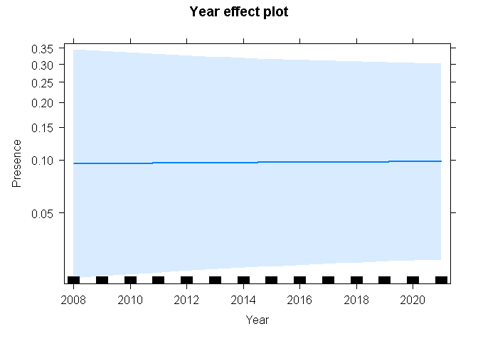
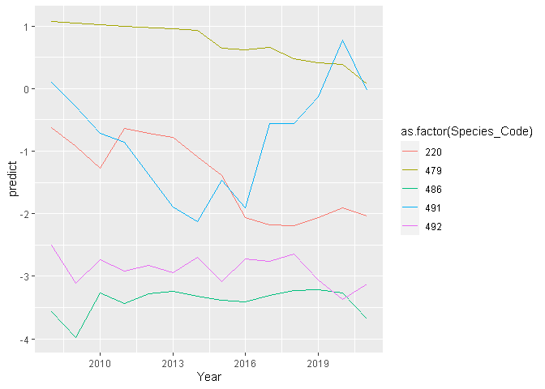

Karoo GLMER
================
Christopher Shortland
2022-05-24

# Libraries

``` r
    library(tidyverse)
```

    ## -- Attaching packages --------------------------------------- tidyverse 1.3.1 --

    ## v ggplot2 3.3.5     v purrr   0.3.4
    ## v tibble  3.1.6     v dplyr   1.0.8
    ## v tidyr   1.2.0     v stringr 1.4.0
    ## v readr   2.1.2     v forcats 0.5.1

    ## -- Conflicts ------------------------------------------ tidyverse_conflicts() --
    ## x dplyr::filter() masks stats::filter()
    ## x dplyr::lag()    masks stats::lag()

``` r
    library(lme4)
```

    ## Loading required package: Matrix

    ## 
    ## Attaching package: 'Matrix'

    ## The following objects are masked from 'package:tidyr':
    ## 
    ##     expand, pack, unpack

``` r
    library(car)
```

    ## Loading required package: carData

    ## 
    ## Attaching package: 'car'

    ## The following object is masked from 'package:dplyr':
    ## 
    ##     recode

    ## The following object is masked from 'package:purrr':
    ## 
    ##     some

``` r
    library(effects)
```

    ## lattice theme set by effectsTheme()
    ## See ?effectsTheme for details.

``` r
    library(ggplot2)
    library(beepr)
```

# Importing final dataset

``` r
        final <- read_csv('output/final_df/final_df.csv')
```

    ## Rows: 17481700 Columns: 11
    ## -- Column specification --------------------------------------------------------
    ## Delimiter: ","
    ## chr  (7): CardNo, Pentad, Spp, Sequence, Common_name, Taxonomic_name, indicator
    ## dbl  (3): Species_Code, Presence, no_pres
    ## date (1): StartDate
    ## 
    ## i Use `spec()` to retrieve the full column specification for this data.
    ## i Specify the column types or set `show_col_types = FALSE` to quiet this message.

# Load fynbos stacked df

``` r
        karoo_df <- filter(final, indicator=='karoo')
```

\#number of indicator species

``` r
    length(unique(karoo_df$Species_Code))
```

    ## [1] 5

# add in year variable

``` r
        karoo_df$Year <- lubridate::year(karoo_df$StartDate)
        str(karoo_df)
```

    ## spec_tbl_df [9,766 x 12] (S3: spec_tbl_df/tbl_df/tbl/data.frame)
    ##  $ Species_Code  : num [1:9766] 220 220 220 220 220 220 220 220 220 220 ...
    ##  $ CardNo        : chr [1:9766] "1955_1955_002025_20110512" "1955_3355_002025_20101026" "1955_3355_002025_20101111" "1955_3355_002025_20101215" ...
    ##  $ StartDate     : Date[1:9766], format: "2011-05-12" "2010-10-26" ...
    ##  $ Pentad        : chr [1:9766] "3355_1955" "3355_1955" "3355_1955" "3355_1955" ...
    ##  $ Spp           : chr [1:9766] "-" "-" "-" "-" ...
    ##  $ Sequence      : chr [1:9766] "-" "-" "-" "-" ...
    ##  $ Common_name   : chr [1:9766] "-" "-" "-" "-" ...
    ##  $ Taxonomic_name: chr [1:9766] "-" "-" "-" "-" ...
    ##  $ Presence      : num [1:9766] 0 0 0 0 0 0 1 1 0 0 ...
    ##  $ no_pres       : num [1:9766] 2 2 2 2 2 2 147 147 2 14 ...
    ##  $ indicator     : chr [1:9766] "karoo" "karoo" "karoo" "karoo" ...
    ##  $ Year          : num [1:9766] 2011 2010 2010 2010 2011 ...
    ##  - attr(*, "spec")=
    ##   .. cols(
    ##   ..   Species_Code = col_double(),
    ##   ..   CardNo = col_character(),
    ##   ..   StartDate = col_date(format = ""),
    ##   ..   Pentad = col_character(),
    ##   ..   Spp = col_character(),
    ##   ..   Sequence = col_character(),
    ##   ..   Common_name = col_character(),
    ##   ..   Taxonomic_name = col_character(),
    ##   ..   Presence = col_double(),
    ##   ..   no_pres = col_double(),
    ##   ..   indicator = col_character()
    ##   .. )
    ##  - attr(*, "problems")=<externalptr>

# Option to run with Indicator Type as a fixed effect

glmer1 \<- glmer(Presence \~ Year\*Indicator_Type + (1 +
Year\|Species_Code), family = ‘binomial’, data = karoo_df)

# measure time taken…

``` r
        start_time <- Sys.time()
```

# run a mixed effects model; year = fixed; species = random

``` r
    glm_karoo <- glmer(Presence ~ scale(Year)  + (scale(Year)|Species_Code) + (1|Pentad), family = 'binomial', data = karoo_df)
    beepr::beep()
    end_time <- Sys.time()
```

# How long did this take to run?

``` r
    end_time - start_time
```

    ## Time difference of 7.494816 secs

# Summary of model

``` r
    summary(glm_karoo)
```

    ## Generalized linear mixed model fit by maximum likelihood (Laplace
    ##   Approximation) [glmerMod]
    ##  Family: binomial  ( logit )
    ## Formula: Presence ~ scale(Year) + (scale(Year) | Species_Code) + (1 |  
    ##     Pentad)
    ##    Data: karoo_df
    ## 
    ##      AIC      BIC   logLik deviance df.resid 
    ##   7334.1   7377.2  -3661.0   7322.1     9760 
    ## 
    ## Scaled residuals: 
    ##     Min      1Q  Median      3Q     Max 
    ## -3.8605 -0.4427 -0.1617 -0.0629 15.9018 
    ## 
    ## Random effects:
    ##  Groups       Name        Variance Std.Dev. Corr 
    ##  Pentad       (Intercept) 3.3543   1.8315        
    ##  Species_Code (Intercept) 2.6047   1.6139        
    ##               scale(Year) 0.0235   0.1533   -0.54
    ## Number of obs: 9766, groups:  Pentad, 116; Species_Code, 5
    ## 
    ## Fixed effects:
    ##              Estimate Std. Error z value Pr(>|z|)   
    ## (Intercept) -2.234726   0.751609  -2.973  0.00295 **
    ## scale(Year)  0.009744   0.095995   0.102  0.91915   
    ## ---
    ## Signif. codes:  0 '***' 0.001 '**' 0.01 '*' 0.05 '.' 0.1 ' ' 1
    ## 
    ## Correlation of Fixed Effects:
    ##             (Intr)
    ## scale(Year) -0.382

# Anova

``` r
    Anova(glm_karoo)
```

    ## Analysis of Deviance Table (Type II Wald chisquare tests)
    ## 
    ## Response: Presence
    ##              Chisq Df Pr(>Chisq)
    ## scale(Year) 0.0103  1     0.9192

# Plot effects

``` r
    plot(allEffects(glm_karoo))
```

    ## Warning in Analyze.model(focal.predictors, mod, xlevels, default.levels, : the
    ## predictor scale(Year) is a one-column matrix that was converted to a vector

<!-- -->

# Predict

``` r
karoo_df$predict <- predict(glm_karoo, karoo_df)

karoo_clean <- karoo_df %>% group_by(Species_Code, Year) %>% summarise(predict = mean(predict))
```

    ## `summarise()` has grouped output by 'Species_Code'. You can override using the
    ## `.groups` argument.

# Prediction plot

``` r
    ggplot(data=karoo_clean, aes(Year, predict)) + 
        geom_line(aes(color = as.factor(Species_Code)))
```

<!-- -->
