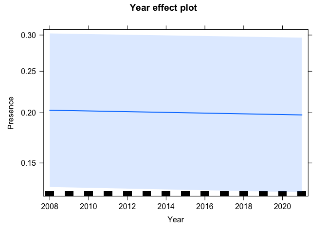

test\_glmer\_fyn
================
JDM WHITE
11/05/2022

    ## Warning: package 'tidyr' was built under R version 4.0.5

    ## Warning: package 'dplyr' was built under R version 4.0.5

    ## Warning: package 'effects' was built under R version 4.0.5

``` r
# Load fynbos stacked df
fyn_df <- read_csv('fynbos_df.csv')
```

    ## Rows: 135934 Columns: 27── Column specification ────────────────────────────────────────────────────────
    ## Delimiter: ","
    ## chr   (7): CardNo, StartTime, Pentad, Spp, Sequence, Common_name, Taxonomic_...
    ## dbl  (18): Species_Code, ObserverNo, TotalHours, Hour1, Hour2, Hour3, Hour4,...
    ## date  (2): StartDate, EndDate
    ## ℹ Use `spec()` to retrieve the full column specification for this data.
    ## ℹ Specify the column types or set `show_col_types = FALSE` to quiet this message.

``` r
# add in year variable
fyn_df$Year <- lubridate::year(fyn_df$StartDate)
str(fyn_df)
```

    ## spec_tbl_df [135,934 × 28] (S3: spec_tbl_df/tbl_df/tbl/data.frame)
    ##  $ Species_Code  : num [1:135934] 181 181 181 181 181 181 181 181 181 181 ...
    ##  $ CardNo        : chr [1:135934] "1800-3300_001449_20150411" "1820_3325_001393_20081019" "1820_3325_002076_20090421" "1845_3415_011138_20090904" ...
    ##  $ StartDate     : Date[1:135934], format: "2015-04-11" "2008-10-19" ...
    ##  $ EndDate       : Date[1:135934], format: "2015-04-11" "2008-10-19" ...
    ##  $ StartTime     : chr [1:135934] ":" "09h00" "14h00" "09:38" ...
    ##  $ Pentad        : chr [1:135934] "3300_1800" "3325_1820" "3325_1820" "3415_1845" ...
    ##  $ ObserverNo    : num [1:135934] 1449 1393 2076 11128 11128 ...
    ##  $ TotalHours    : num [1:135934] 3 2 3 3 3 4 3 2 2 3 ...
    ##  $ Hour1         : num [1:135934] 24 30 14 11 12 20 18 27 15 10 ...
    ##  $ Hour2         : num [1:135934] 45 42 21 15 19 31 28 35 26 15 ...
    ##  $ Hour3         : num [1:135934] 55 0 34 28 0 0 38 0 0 24 ...
    ##  $ Hour4         : num [1:135934] 0 0 0 0 0 0 0 0 0 0 ...
    ##  $ Hour5         : num [1:135934] 0 0 0 0 0 0 0 0 0 0 ...
    ##  $ Hour6         : num [1:135934] 0 0 0 0 0 0 0 0 0 0 ...
    ##  $ Hour7         : num [1:135934] 0 0 0 0 0 0 0 0 0 0 ...
    ##  $ Hour8         : num [1:135934] 0 0 0 0 0 0 0 0 0 0 ...
    ##  $ Hour9         : num [1:135934] 0 0 0 0 0 0 0 0 0 0 ...
    ##  $ Hour10        : num [1:135934] 0 0 0 0 0 0 0 0 0 0 ...
    ##  $ TotalSpp      : num [1:135934] 55 42 48 28 24 42 45 36 28 24 ...
    ##  $ InclNight     : num [1:135934] 0 0 0 0 0 1 0 1 0 1 ...
    ##  $ AllHabitats   : num [1:135934] 0 1 1 1 0 1 1 1 0 1 ...
    ##  $ Spp           : chr [1:135934] "181" "181" "181" "181" ...
    ##  $ Sequence      : chr [1:135934] "5" "12" "42" "10" ...
    ##  $ Common_name   : chr [1:135934] "Spurfowl, Cape" "Spurfowl, Cape" "Spurfowl, Cape" "Spurfowl, Cape" ...
    ##  $ Taxonomic_name: chr [1:135934] "Pternistis capensis" "Pternistis capensis" "Pternistis capensis" "Pternistis capensis" ...
    ##  $ Presence      : num [1:135934] 1 1 1 1 1 0 1 1 1 0 ...
    ##  $ no_pres       : num [1:135934] 116 82 82 137 137 29 282 282 282 14 ...
    ##  $ Year          : num [1:135934] 2015 2008 2009 2009 2009 ...
    ##  - attr(*, "spec")=
    ##   .. cols(
    ##   ..   Species_Code = col_double(),
    ##   ..   CardNo = col_character(),
    ##   ..   StartDate = col_date(format = ""),
    ##   ..   EndDate = col_date(format = ""),
    ##   ..   StartTime = col_character(),
    ##   ..   Pentad = col_character(),
    ##   ..   ObserverNo = col_double(),
    ##   ..   TotalHours = col_double(),
    ##   ..   Hour1 = col_double(),
    ##   ..   Hour2 = col_double(),
    ##   ..   Hour3 = col_double(),
    ##   ..   Hour4 = col_double(),
    ##   ..   Hour5 = col_double(),
    ##   ..   Hour6 = col_double(),
    ##   ..   Hour7 = col_double(),
    ##   ..   Hour8 = col_double(),
    ##   ..   Hour9 = col_double(),
    ##   ..   Hour10 = col_double(),
    ##   ..   TotalSpp = col_double(),
    ##   ..   InclNight = col_double(),
    ##   ..   AllHabitats = col_double(),
    ##   ..   Spp = col_character(),
    ##   ..   Sequence = col_character(),
    ##   ..   Common_name = col_character(),
    ##   ..   Taxonomic_name = col_character(),
    ##   ..   Presence = col_double(),
    ##   ..   no_pres = col_double()
    ##   .. )
    ##  - attr(*, "problems")=<externalptr>

``` r
# run a mixed effects model; year = fixed; species = random
glm1 <- glmer(Presence ~ Year  + (1|Species_Code), family = 'binomial', data = fyn_df)
```

    ## Warning in checkConv(attr(opt, "derivs"), opt$par, ctrl = control$checkConv, : Model is nearly unidentifiable: very large eigenvalue
    ##  - Rescale variables?;Model is nearly unidentifiable: large eigenvalue ratio
    ##  - Rescale variables?

``` r
summary(glm1)
```

    ## Generalized linear mixed model fit by maximum likelihood (Laplace
    ##   Approximation) [glmerMod]
    ##  Family: binomial  ( logit )
    ## Formula: Presence ~ Year + (1 | Species_Code)
    ##    Data: fyn_df
    ## 
    ##      AIC      BIC   logLik deviance df.resid 
    ## 150462.7 150492.1 -75228.3 150456.7   135931 
    ## 
    ## Scaled residuals: 
    ##     Min      1Q  Median      3Q     Max 
    ## -1.1229 -0.6227 -0.4319  0.9014  3.5926 
    ## 
    ## Random effects:
    ##  Groups       Name        Variance Std.Dev.
    ##  Species_Code (Intercept) 0.6071   0.7792  
    ## Number of obs: 135934, groups:  Species_Code, 8
    ## 
    ## Fixed effects:
    ##               Estimate Std. Error z value Pr(>|z|)    
    ## (Intercept)  6.7973736  0.2723734   24.96   <2e-16 ***
    ## Year        -0.0040588  0.0001913  -21.22   <2e-16 ***
    ## ---
    ## Signif. codes:  0 '***' 0.001 '**' 0.01 '*' 0.05 '.' 0.1 ' ' 1
    ## 
    ## Correlation of Fixed Effects:
    ##      (Intr)
    ## Year -0.702
    ## optimizer (Nelder_Mead) convergence code: 0 (OK)
    ## Model is nearly unidentifiable: very large eigenvalue
    ##  - Rescale variables?
    ## Model is nearly unidentifiable: large eigenvalue ratio
    ##  - Rescale variables?

``` r
# car::Anova
Anova(glm1)
```

    ## Analysis of Deviance Table (Type II Wald chisquare tests)
    ## 
    ## Response: Presence
    ##       Chisq Df Pr(>Chisq)    
    ## Year 450.16  1  < 2.2e-16 ***
    ## ---
    ## Signif. codes:  0 '***' 0.001 '**' 0.01 '*' 0.05 '.' 0.1 ' ' 1

``` r
# Plot effects
plot(allEffects(glm1))
```

<!-- -->
